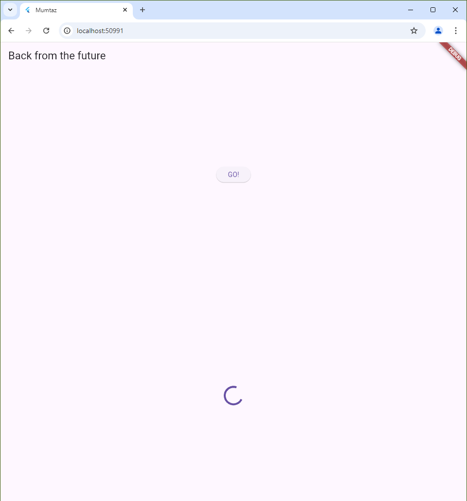
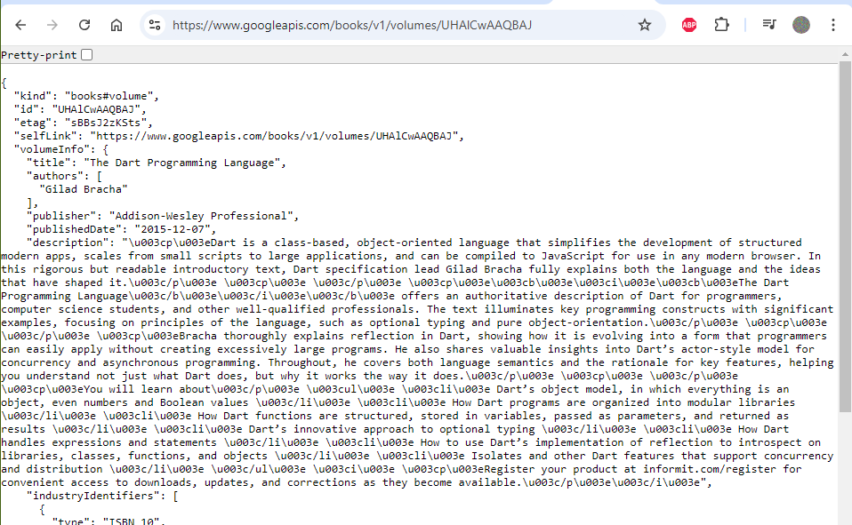
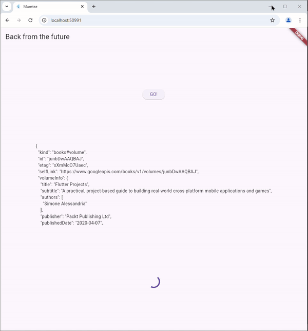

# books

A new Flutter project.

## Getting Started

Soal 1

Soal 2

Soal 3

result = value.body.toString().substring(0, 450);
Substring(start, end) mengambil karakter dari indeks start sampai end-1.
Menghasilkan teks mulai dari karakter pertama (indeks 0) hingga karakter ke-450 (indeks 449).

Method catchError digunakan untuk menangani error pada operasi asinkron (seperti Future).

Soal 4

Langkah 1 mendefinisikan tiga fungsi asinkron (async) yang masing-masing mengembalikan nilai integer setelah penundaan tiga detik.
Langkah 2 adalah fungsi Future asinkron yang mengumpulkan nilai dari tiga fungsi (returnOneAsync, returnTwoAsync, dan returnThreeAsync) secara berurutan, menambahkannya ke variabel total, dan akhirnya memperbarui nilai result di dalam metode setState

Soal 5

Langkah 2 menggunakan Completer untuk mengelola nilai yang akan diselesaikan di masa depan. Completer di sini berfungsi untuk memisahkan inisialisasi Future dari penyelesaiannya, memungkinkan fungsi lain untuk menyelesaikan Future pada waktu tertentu.

Soal 6

Penambahan mekanisme untuk menangani error. Dengan adanya blok try-catch, jika terjadi error dalam calculate, maka completer akan menyelesaikan Future dengan error melalui completeError, bukan dengan nilai normal.

Soal 7

Soal 8

FutureGroup digunakan untuk menambahkan Future secara dinamis satu per satu dan dapat ditutup dengan close(). Cocok jika jumlah atau daftar Future tidak diketahui di awal. Sedangkan future.wait digunakan untuk menjalankan banyak Future sekaligus dalam satu daftar yang sudah tetap. Sederhana dan lebih cocok jika semua Future sudah diketahui sebelumnya.

Soal 9

Soal 10

returnError() hanya menghasilkan Future yang gagal dengan melemparkan error tanpa menangani kesalahan.
handleError() memanggil returnError() dan menangani error menggunakan try-catch, lalu memperbarui UI dengan setState dan menjalankan tugas cleanup di blok finally.